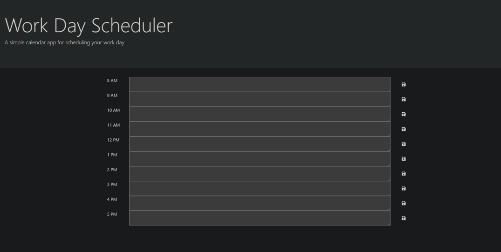

# Jessi-planner

BootCamp Challenge - 05 Third-Party APIs Challenge: Work Day Scheduler

## Description

To create a work day scheduler to allow user's to complete their tasks on time.

## The look

## Installation

Project is upload to [Github](https://github.com/) at the following [respository.](https://github.com/mysteriousdj/Jessi-planner)

Access to [Webpage.](https://mysteriousdj.github.io/Jessi-planner/)